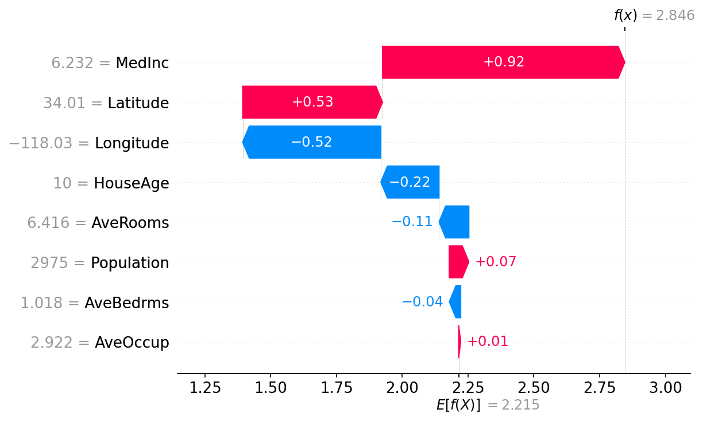
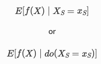

# Shapley Values (SHAP) — Guía Profunda para el Proyecto

# 1) Introducción
En términos de gobernanza y trazabilidad, SHAP (Shapley Additive exPlanations) es el estándar de facto para explicar predicciones de modelos de ML a nivel local (por cliente) y global (patrones en la población). La guía oficial presenta una progresión didáctica —de regresión lineal a árboles potenciados y transformadores NLP— para construir una comprensión sólida de qué son los valores de Shapley, cómo se calculan en la práctica y por qué su propiedad aditiva y su vínculo con la teoría de juegos les confieren consistencia y auditabilidad operacional.

# 2) ¿Qué son los Shapley Values?

## Fundamento teórico y propiedad aditiva.
Los valores de Shapley reparten de forma “justa” la contribución de cada variable al resultado del modelo. En Machine Learning, SHAP define una línea base (valor esperado del modelo) y descompone la predicción individual como suma de contribuciones por feature; esa aditividad garantiza que la suma de aportes iguale la diferencia entre predicción y baseline, lo que habilita visualizaciones como waterfall plots y diagnósticos reproducibles.

## Cómputo y lectura práctica.
En términos operativos, SHAP calcula, para cada observación, un vector de contribuciones cuyo agregado reproduce la predicción. En lineales, la intuición se ancla en diferencias respecto al valor esperado y puede visualizarse como una versión “centrada” de los PDPs; en árboles, TreeSHAP permite escalar a producción preservando exactitud. 

# 3) Conclusión
Para el proeycto SHAP aporta tres ventajas diferenciales: 
* (1) transparencia local: comunica “por qué” el sistema sugiere una acción específica mediante un top-N de contribuciones. 
* (2) consistencia global: permite monitorear estabilidad de drivers en el tiempo y detectar drift.
* (3) rigurosidad: su formalismo de teoría de juegos, sumado a implementaciones eficientes (TreeSHAP), viabiliza despliegues productivos con auditoría. 

En suma, SHAP estructura un lenguaje común entre ciencia de datos y negocio para confiar, auditar y accionar sobre predicciones, desde modelos lineales hasta arquitecturas avanzadas, manteniendo una línea clara entre explicabilidad predictiva y conclusiones causales.

# 4) Referencia
“An introduction to explainable AI with Shapley values”, documentación oficial de SHAP (secciones de introducción, lineal/GAM/árboles/transformers, propiedad aditiva, correlación y notas sobre interpretación).
